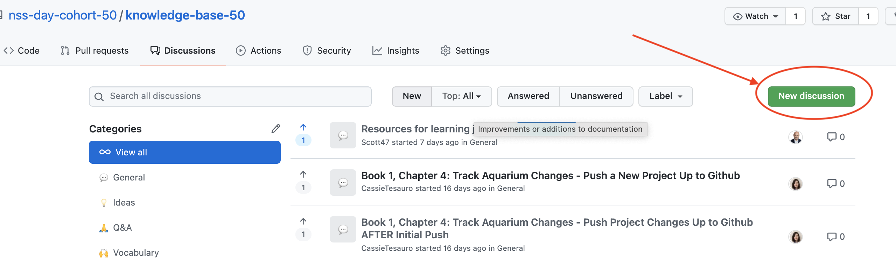

## Welcome to cohort-50 knowledge base. 
This repo is for discussing issues and storing helpful information.

As professional software developers, you have to be curious, inquisitive, willing to be uncomfortable and learn from a lot of failure. 

It is your responsibility to own your learning experience while at NSS and this can be a useful tool for doing that. Think of discussions as your own stack overflow for your time at NSS. Here is how you use it. 

1. Click the 'Discussions' tab in this repo.
1. Click the new discussion tab
or Select a discussion to read/comment on
1. Once you select a new discussion, you will want to give it a title that gives good context for your post (i.e. Resources for git/github with teams or TypeError: Cannot read property name of undefined.)
1. Next, you will want to select a category for your discussion 
1. Then, select a label that is appropriate for your discussion post. 
1. Finally, click "Start Discussion"